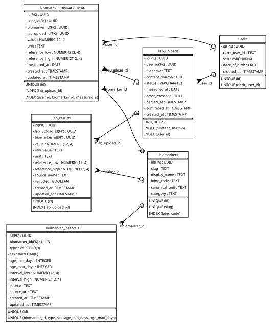

# Data model

Entity–relationship diagram of the backend schema.



Regenerate after a schema change:

```bash
cd api
docker run -d --name erd -e POSTGRES_PASSWORD=pw -e POSTGRES_DB=mirai -p 55433:5432 postgres:17
export DATABASE_URL=postgresql+pg8000://postgres:pw@localhost:55433/mirai
uv run alembic upgrade head
uv run --with sqlalchemy_schemadisplay --with pydot python scripts/render_erd.py
docker rm -f erd
```